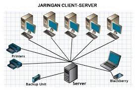

# שיעור 19 - מה זה שרת?

[קישור לסרטון העשרה בנושא]([https://link](https://www.youtube.com/watch?v=AOf_CMBdv4M))



- מי פונה אל השרת
- השרת צריך להיות זמין תמיד
- האינטרנט מטרכב מתקשורת בין אוסף של שרתי
- מה הדרישות משרת
- שרת יכול לתת כשירות: קבצי, הדפסה, אישור זהויות, וביצוע פעולות

## העשרה מבנה הURL
שורת טקסט מהמיגת מיקום של דף אינטרנט

נרחיב על מבנה הURL המשמש לתקשורת באמצעותHTTP / HTTPS

```
schema://server:port/path?query#anchor
```
### לדוגמה
1. פרוטוקול http / https `https://`
2. דומיין - server name `elhay-av.github.io`
3. פורט - port `:80`
4. כתובת - path `/web-dev-enav/CLASS_19.html`
5. משתנים - query `?year=2022`
6. מיקום פנימי בדף anchor `#העשרה מבנה הURL`

```
https://elhay-av.github.io/web-dev-enav/CLASS_19.html?year=2022#%D7%94%D7%A2%D7%A9%D7%A8%D7%94%20%D7%9E%D7%91%D7%A0%D7%94%20%D7%94URL
```