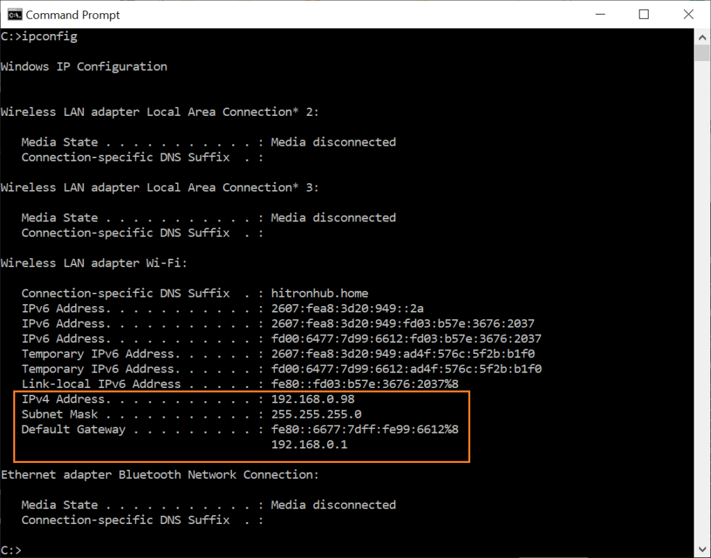

# שיעור 20 - מה זה DNS?

## Domain דומיין (תחום)
זהו השם של האתר / שרת באותיות. לדוגמה l18.me

בכל רשת יש שרת עם טבלת כתובות, והוא אחראי להתאים לכל כתובת מילולית את הכתובת המספרית שלה
שרת זה נקרא DNS
Domain Name Server

# IP כתובת שרת במספרים
לכל אתר יש כתובת מספרית שדרה מתבצעת התקשורת איתו. לדוגמה
192.168.0.1
שימו לב שהכתובת מחולקת ל4 באמצעות נקודות

# כתובת פרטית
כל מכשיר שמתחבר לרשת מקבל מהראוטר שמנהל את הרשת כתובת IP
כתובת זו נקראת כתובת פרטית והי מייצגת את המכשיר מול הראוטר ומול שאר המכשירים ברשת הפנימית.

כאשר אנחנו ניגשים לאינטרנט אנחנו פונים לראוטר של הרשת שלנו והוא פונה לספק האינטרנט.

# כתובת חיצונית / ציבורית
כאשר הראוטר שלנו פנה לספק האינטרנט כדי להתחבר, הוא קיבל מהספק כתובת IP ציבורית
באמצעות כתובת זו השרת יכול לשלוח לרשת האנטרנט בקשות
וכמו כן יוכלו לפנות אליו בחזרה עם בקשות ממכשירים אחרים ברשת האינטרנט

## ניסוי:
1. בדקו מה כתובת הIP החיצונית שלכם
https://ifconfig.me/
האם לכולם יצא אותו דבר?

2. בדקו מה כתובת ה IP התנימית שלכם
   - לחצו על כפתור התחל במקלדת 
   - בתבו: `cmd` והקישו אנטר
   - כתבו `ipconfig`

האם יצא לכולם אותו דבר?

  